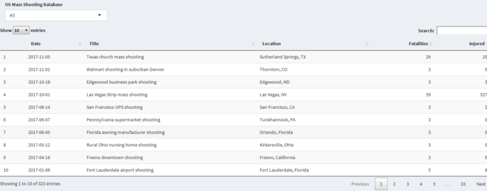

```{r setup, include=FALSE}
knitr::opts_chunk$set(echo = FALSE)
library(gtrendsR)
library(rworldmap)
library(reshape2)
library(maps)
library(rvest)
library(scales)
library(stringr)
library(tidyverse)
library(tidytext)
library(readtext)
library(wordcloud)
library(data.table)
library(png)
library(ggpubr) ### arrangle mutiple plot into one page
library(RCurl)  ### read online html table 
library(rlist)
library(XML)

```

## Introduction
- Google Trends Gun Control Toic
- Guns Per 100 Captia by country
- Text Analysis President Obama and Trump Gun Control Public Talk
- Time Series Anaysis US Mass Shooting in the Last 50 Years
- Building Interactive US Mass Shooting Datatable 

## <span style="font-size: 36px;">Google Trends Analyze Gun Control Topic</span>
Google Trend is a pub web of Google Inc.,base on Google Search that 
shows how often a particular serach-term is entered relative to
the total search-volume across various regions of the world.

The search-term for my project are : 

 <div class="red2">
 - US Gun Control 
 </div>
 
 <div class="red2">
 - World Gun Control
 </div>

## <span style="font-size: 36px;">Google Trend World Gun Control Popularity</span>

```{r warning = FALSE,message= FALSE,results="hide",fig.keep="last"}
google.trends_region <- gtrends(c("gun control"), gprop = "web", time = "all")[[c(2)]]

google.trends_region <- google.trends_region[-c(192,210),]
google.trends_region <- dcast(google.trends_region, location ~ keyword + geo, value.var = "hits")
colnames(google.trends_region)[colnames(google.trends_region)=="gun control_world"] <- "popularity"


### load world map
world_map <- maps::map("world2", ".", exact = FALSE, plot = FALSE, fill = TRUE) %>% fortify()

google.trends_region$location <- recode(google.trends_region$location
                                      ,"United States"= 'usa' 
                                      ,'United Kingdom' = 'uk'
)
google.trends_region$country <- tolower(google.trends_region$location) 


country<- joinCountryData2Map(google.trends_region, joinCode = "NAME", nameJoinColumn = 'country', verbose = T)
mapCountryData(country, nameColumnToPlot="popularity", mapTitle="Gun_Control Topic World Popularity")

```

## <span style="font-size: 36px;">Google Trend US Gun Control Popularity</span>
```{r warning= FALSE,message=FALSE}
google.trends = gtrends(c("gun control"), gprop = "web", time = "all")[[c(1)]]
google.trends2 = dcast(google.trends, date ~ keyword + geo, value.var = "hits")
rownames(google.trends2) = google.trends$date
colnames(google.trends2)[colnames(google.trends2)=="gun control_world"] <- "popularity"

### Timeseries plot of gun control popularity over time 

ggplot(data = google.trends2, aes(date,popularity,color = "green"))+
  geom_line()+
  ggtitle("gun control google popularity")+
  theme(plot.title = element_text(hjust = 0.5))+
  scale_x_date(
    limits = as.Date(c("2002-01-01", "2018-01-01")),
    date_labels = "%Y",
    date_breaks = "2 years")+
  theme(legend.position = "none")

```

## <span style="font-size: 36px;">World Map Guns per 100 Capita</span>

```{r warning = FALSE,message= FALSE,results="hide",fig.keep="last"}
theurl <- getURL("https://en.wikipedia.org/wiki/Estimated_number_of_guns_per_capita_by_country",.opts = list(ssl.verifypeer = FALSE) )
tables <- readHTMLTable(theurl)
tables <- list.clean(tables, fun = is.null, recursive = FALSE)

Gun_per_capital <- tables[[1]]
Gun_per_capital3<-Gun_per_capital %>%
  select(-Rank,-Notes)
colnames(Gun_per_capital3)[2] <- "guns_per_100"
Gun_per_capital3$guns_per_100<-as.vector(Gun_per_capital3$guns_per_100)
x <- strsplit(Gun_per_capital3$guns_per_100, '[', fixed = T)
Gun_per_capital3$guns_per_100 <- sapply(x, function(y){y[1]})
Gun_per_capital3<-Gun_per_capital3[-1,]

Gun_per_capital3$Country<-as.character(Gun_per_capital3$Country)
Gun_per_capital3$guns_per_100<-as.numeric(Gun_per_capital3$guns_per_100)


country2<- joinCountryData2Map(Gun_per_capital3, joinCode = "NAME", nameJoinColumn = 'Country', verbose = T)

colourPalette <- brewer.pal(7,'Set3')
mapParams <- mapCountryData(country2,
                            nameColumnToPlot="guns_per_100",
                            addLegend=FALSE,
                            catMethod = "logFixedWidth",
                            colourPalette= colourPalette,
                            mapTitle = "Map of Guns Per 100 Capita by Country")
do.call(addMapLegend
        ,c(mapParams
           ,legendLabels="all"
           ,legendWidth=0.5
           ,legendIntervals="data"
           ,legendMar = 2))

```


## <span style="font-size: 30px;">Text Analysis President Obama Gun Control Public Talk </span>

```{r message= FALSE}
fileText <- readtext("Obama_2013.txt")

tidy_books_obama <- data_frame(text = fileText$text) %>% unnest_tokens(word, text)
bing_word_counts_obama <- tidy_books_obama %>%
  inner_join(get_sentiments("bing")) %>%
  count(word, sentiment, sort = TRUE) %>%
  ungroup()

bing_word_counts_obama %>%
  group_by(sentiment) %>%
  top_n(10) %>%
  ungroup() %>%
  mutate(word = reorder(word, n)) %>%
  ggplot(aes(word, n, fill = sentiment)) +
  geom_col(show.legend = FALSE) +
  facet_wrap(~sentiment, scales = "free_y") +
  ggtitle("Obama 2013 Gun Control Public Talk")+
  theme(plot.title = element_text(hjust = 0.5))+
  labs(y = "Contribution to sentiment",
       x = NULL) +
  coord_flip()


```

## <span style="font-size: 30px;">Text Analysis President Trump Gun Control Public Talk </span>

```{r message= FALSE}
fileText2 <- readtext("trump_2018.txt")

tidy_books_trump <- data_frame(text = fileText2$text) %>% 
  unnest_tokens(word, text)%>% 
  filter(word !="trump")   ### Trump count as a pistive word, So I have to remove it.

bing_word_counts_trump <- tidy_books_trump %>%
  inner_join(get_sentiments("bing")) %>%
  count(word, sentiment, sort = TRUE) %>%
  ungroup()

bing_word_counts_trump %>%
  group_by(sentiment) %>%
  top_n(10) %>%
  ungroup() %>%
  mutate(word = reorder(word, n)) %>%
  ggplot(aes(word, n, fill = sentiment)) +
  geom_col(show.legend = FALSE) +
  facet_wrap(~sentiment, scales = "free_y") +
  ggtitle("Trump 2018 Gun Control Public Talk")+
  theme(plot.title = element_text(hjust = 0.5))+
  labs(y = "Contribution to sentiment",
       x = NULL) +
  coord_flip()

```

## <span style="font-size: 30px;">WordCloud Analysis President Obama Gun Control Public Talk </span>

```{r warning=FALSE,message= FALSE,fig.height=4,fig.width=6}
tidy_books_obama %>%
  inner_join(get_sentiments("bing")) %>%
  count(word, sentiment, sort = TRUE) %>%
  acast(word ~ sentiment, value.var = "n", fill = 0) %>%
  comparison.cloud(colors = c("#F8766D", "#00BFC4"),
                   max.words = 88)

```


## <span style="font-size: 28px;">WordCloud Analysis President Trump Gun Control Public Talk </span>

```{r warning=FALSE,message = FALSE,fig.height=4,fig.width=6}
tidy_books_trump %>%
  inner_join(get_sentiments("bing")) %>%
  count(word, sentiment, sort = TRUE) %>%
  acast(word ~ sentiment, value.var = "n", fill = 0) %>%
  comparison.cloud(colors = c("#F8766D", "#00BFC4"),
                   max.words = 88)

```


##<span style="font-size: 28px;">Word frequency Analysis President Obama Gun Control Public Talk </span>

```{r warning=FALSE,message = FALSE,fig.height=4,fig.width=6}
tidy_books_obama1 <- tidy_books_obama %>%
  anti_join(stop_words)%>%
  count(word,sort = TRUE)

p1<-wordcloud(words = tidy_books_obama1$word, freq = tidy_books_obama1$n,scale = c(4,0.1), min.freq = 1,
          max.words=100, random.order=FALSE, rot.per=0.1, 
          colors=brewer.pal(8, "Dark2"))

```


##<span style="font-size: 30px;">Word frequency Analysis President Trump Gun Control Public Talk </span>

```{r warning=FALSE,message = FALSE,fig.height=4,fig.width=6}
tidy_books_trump1 <- tidy_books_trump %>%
  anti_join(stop_words)%>%
  filter(word !="president")%>%
  count(word,sort = TRUE)

p2<-wordcloud(words = tidy_books_trump1$word, freq = tidy_books_trump1$n,scale = c(4,0.1), min.freq = 1,
          max.words=100, random.order=FALSE, rot.per=0.1, 
          colors=brewer.pal(8, "Dark2"))

```

## <span style="font-size: 30px;">US Mass Shooting Death/Injured in Past 50 Years</span>
```{r warning=FALSE,message=FALSE}
#################################

df1<-fread("Mass Shootings Dataset Ver 5.csv")
df2 <- df1 %>%
  select(Date,Fatalities,Injured)
df2$Date <- as.Date(df2$Date,"%m/%d/%Y")
df4 <- df2 %>% 
  gather(key ="Type",value = "Individual",-Date)
df5 <- subset(df1,Title != "Las Vegas Strip mass shooting") 
df6 <- df5 %>%
  select(Date,Fatalities,Injured)
df6$Date <- as.Date(df6$Date,"%m/%d/%Y")
df7 <- df6 %>% 
  gather(key ="Type",value = "Individual",-Date)

#################################
    g1 <- ggplot(data = df4, aes(Date, Individual, color = Type),na.rm = T) +
      geom_line()+ 
      ggtitle("Mass Shooting in US ")+
      theme(plot.title = element_text(hjust = 0.5))+
      scale_x_date(
        limits = as.Date(c("1965-01-01", "2018-05-01")),
        date_labels = "%Y",
        date_breaks = "5 years")+
      theme(legend.position=c(.1,.85))
    g2<-ggplot(data = df7, aes(Date, Individual, color = Type),na.rm = T) +
      geom_line()+ 
      ggtitle("Mass Shooting in US/ No include Las_Vegas Shooting ")+
      theme(plot.title = element_text(hjust = 0.5))+
      scale_x_date(
        limits = as.Date(c("1965-01-01", "2018-05-01")),
        date_labels = "%Y",
        date_breaks = "5 years")+
      theme(legend.position=c(.1,.85))	
    ggarrange(g1,g2,ncol = 1,nrow = 2,labels = c("A","B"))

```

## <span style="font-size: 30px;">US Mass Shooting Causes in Past 50 Years</span>

```{r warning=FALSE,message=FALSE}
df1<-fread("Mass Shootings Dataset Ver 5.csv")
df2 <- df1 %>%
  select(Date,Fatalities,Injured)
df2$Date <- as.Date(df2$Date,"%m/%d/%Y")
df4 <- df2 %>% 
  gather(key ="Type",value = "Individual",-Date)
df_Victim <- aggregate(data.frame(count = df1$Cause), list(value = df1$Cause), length)
df_victim2 <- df_Victim[-1,]
colnames(df_victim2)[1] <- "cause"

ggplot(data=df_victim2, aes(x=cause, y= count,fill=cause)) +
  geom_bar(stat="identity")+
  theme(axis.text.x = element_text(angle=65, vjust=0.6))+
  ggtitle("Type of Causes in US Mass Shootings")+
  theme(plot.title = element_text(hjust = 0.5))

```


## <span style="font-size: 30px;">US Mass Shooting Datatable</span>
Highly recommend to check out this Datatable on my shiny app.[shinyapp](https://jxiao11.shinyapps.io/Shiny_Final/).
This table provides a search function and includes all US mass shootings information in past 50 years.



## Discussion

1.Google Trends Gun Control Topic

  + <span style="font-size: 18px;">US has the highest Gun Control topic popularity</span>
  
2.Guns Per 100 Captia by country

  + <span style="font-size: 18px;">As we can see United States has most gun per 100 capita, and almost double than the second most</span>
  
## Discussion...

3.Text Analysis President Obama and Trump Gun Control Public Talk

  + <span style="font-size: 18px;">I dont't think President Obama did a good job about reducing mass    shootings or gun control,Obama have done 14 speeches after 14 mass shootings. In my opinion, he was trying to complete his duties rather than solving the most fundamental problem.However,President Obama did a better job than Trump,As we can see Trump did mention less Guns or Gun control in his response after shooting.  Basically,all his talks is about blaming-victim. He never address gun problem</span>
 
## Discussion...

4.Time Series and Histogram Anaysis US Mass Shooting in the Last 50 Years

  + <span style="font-size: 18px;">We can see the Mass shooting happens more frequently after 2007 and more people are injured and dead in  shooting after 1982.</span>
  
  + <span style="font-size: 18px;">the main causes of mass shooting are psycho and anger. In my opinion, there is a clearly link between mass shooting and mental ilness.</span>


